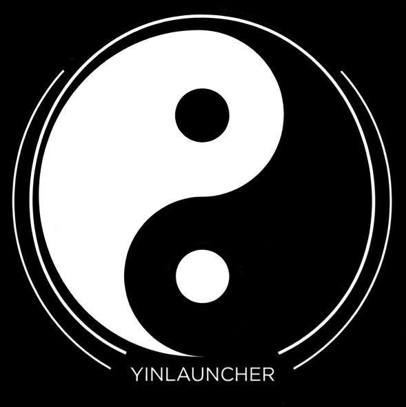

<div align="center">
  
  
  # YinLauncher
  
  [](https://github.com/3uer/YinLauncher/releases)
  [](https://www.android.com/)
  
  **Minimalist. Fast. Yours.**
</div>


---

## About the Project

**YinLauncher** is an independent fork of the LeviLaunchroid project, built around the concept of absolute balance. Zero visual clutter and intrusive elements. Just a clean, monochrome interface and complete low-level control over the game's file system. 

The goal of this project is to provide power users with a tool that combines isolated version management with a robust, integrated content manager.

## Key Features

* **Version Isolation (Zero-Install):** Run official Minecraft APKs without installing them into the Android OS. Each version operates within its own secure container with independent save data.
* **CurseForge Integration:** Built-in CurseForge API parser. Search, download, and automatically install `.mcpack` and `.mcworld` files directly into the target game directory.
* **Native Module Injection:** Full support for loading custom `.so` libraries (C++) to deeply modify rendering logic and core game mechanics.
* **Monochrome UI:** The interface is designed with a focus on deep black (True Black), which is perfect for OLED displays and significantly reduces eye strain.

## Deployment & Usage

1. Download the latest APK from the [Releases](https://github.com/3uer/YinLauncher/releases) section.
2. A legally purchased license for MCBE is required for proper functionality.
3. On the first launch, grant the `All Files Access` permission. This is critical for the `UnpairCore` file isolation system to work.
4. Import your target game APK and launch the container.

## Building from Source

This project contains C++ dependencies (NDK) required for the injection system. You can build the project locally or utilize configured CI/CD pipelines.

```bash
git clone [https://github.com/3uer/YinLauncher.git](https://github.com/3uer/YinLauncher.git)
cd YinLauncher
./gradlew assembleDebug
